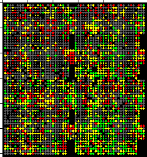

# Introduction

This is Mark James Thompson's repository for STA 426 Statistical Analysis of High-Throughput Genomic and Transcriptomic Data.

It will contain a number of statistical excercises related to genomic data with a focus on multiple sclerosis genetic pathologies.

<!-- Include an image; --> 

# Alternate Content
<!-- Include a web link --> 
This links to the [MS Register UZH](https://www.dsi.uzh.ch/de/projects/multiple-sklerose.html)